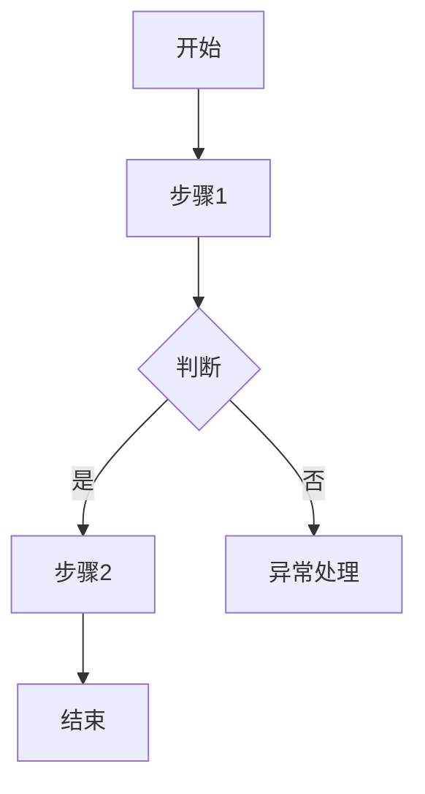

# 流程文档（SOP）编写规范

## 必备章节

1. **目的** — 为什么要有这个流程
2. **适用范围** — 哪些部门/场景适用
3. **术语定义** — 关键术语解释
4. **角色与职责** — 各岗位做什么
5. **流程图** — Mermaid 格式
6. **详细步骤** — 逐步说明
7. **相关文件** — 模板、表单索引
8. **修订记录** — 版本历史

## 流程图要求

使用 Mermaid `flowchart TD` 格式，示例：



## 步骤描述格式

| 步骤 | 角色 | 操作 | 输入 | 输出 | 时效 |
|------|------|------|------|------|------|
| 1 | | | | | |

## Front Matter

```yaml
---
title: 流程名称
type: sop
status: draft
version: 1.0
---
```

## 修订记录格式

| 版本 | 日期 | 修订内容 | 修订人 |
|------|------|----------|--------|
| 1.0 | | 初版发布 | |
