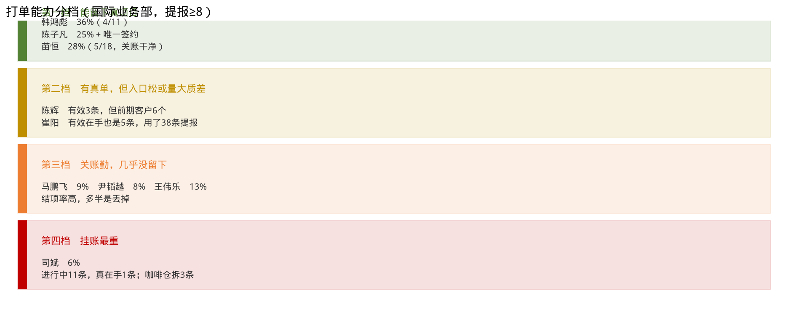
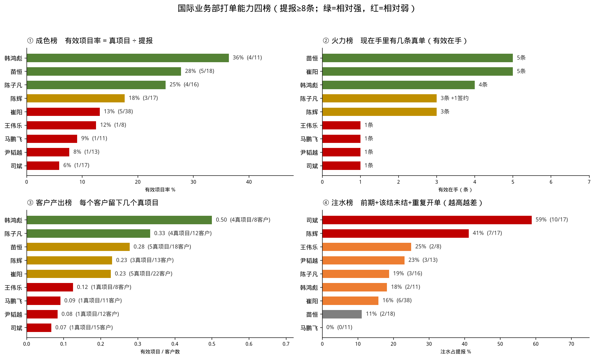

# 专项：国际业务部打单能力（截至 8 月 17 日）

数据：国际业务部方案任务 **165** 条（已剔郭朝伟）。打单能力看**留下了什么**，不看报了多少、关了多少。结项率高只说明敢划掉死单。完整口径见 `docs/reports/briefings/business/2026-08-17-方案任务跟进质量分析.md`。

主排名只比提报 **≥8 条**的 9 人。冯乐 / 张硕 / 王伟超样本不足，页末单列。

## 页 1｜先看分档

| 档 | 人 | 一句话 |
|----|----|--------|
| **能留下** | 韩鸿彪、陈子凡、苗恒 | 提了还能剩下真项目；陈子凡是样本内唯一签约 |
| **有真单，质不稳** | 陈辉、崔阳 | 陈辉前期客户 6 个；崔阳 38 条只留下 5 条 |
| **关账勤，没留下** | 马鹏飞、尹韬越、王伟乐 | 结项率高，多半是丢掉 |
| **挂账最重** | 司斌 | 17 条只留下 1 条，进行中 11 条里真在手 1 条 |

演讲备注：这页就是结论。后面三组排名都在解释「为什么是这四档」。不要用结项率给尹韬越、马鹏飞、崔阳打高分。

## 页 2｜四榜一张图

四组数各管一件事：

1. **成色**：提 10 个能留下几个真的  
2. **火力**：现在手里有几条真单  
3. **客户产出**：每个客户能啃出几个真项目  
4. **注水**：提报里有多少前期 / 该结未结 / 重复开单（越高越差）

演讲备注：韩鸿彪三榜靠前。崔阳火力榜并列第一（有效在手 5），成色榜和客户产出榜都靠后——量大，不是打单强。司斌四榜都在底下。马鹏飞注水 0%，那是关得快，不是打得成。

## 页 3｜成色榜：提了还能剩下多少

有效项目率 =（签约 + 有效在手）÷ 提报。全员只有 **18%**。

| 排名 | 业务员 | 有效项目率 | 真项目 / 提报 | 读法 |
|-----:|--------|----------:|--------------:|------|
| 1 | 韩鸿彪 | **36%** | 4 / 11 | 创建满 8 条的人里最能留下 |
| 2 | 苗恒 | **28%** | 5 / 18 | 广撒网也能关得掉、留得下 |
| 3 | 陈子凡 | **25%** | 4 / 16 | 含样本内**唯一签约**（蒙古 MAK） |
| 4 | 陈辉 | 18% | 3 / 17 | 刚好全员平均；前期多，成色虚 |
| 5 | 崔阳 | 13% | 5 / 38 | 报得最多，留下比例最低档 |
| 5 | 王伟乐 | 13% | 1 / 8 | 裕廊港一条真的 |
| 7 | 马鹏飞 | 9% | 1 / 11 | 关了 7 条，只剩生力冷却站 |
| 8 | 尹韬越 | 8% | 1 / 13 | 结项率全员最高（69%），打单倒数 |
| 9 | 司斌 | **6%** | 1 / 17 | 成色最差 |

演讲备注：报得最多的人不是打单最好的人。尹韬越 69% 结项率对上 8% 有效项目率——关的是死单。

## 页 4｜火力榜：手里现在有几条真单

只数有效在手。签约另标。

| 排名 | 业务员 | 有效在手 | 签约 | 提报 | 读法 |
|-----:|--------|--------:|-----:|-----:|------|
| 1 | 苗恒 | **5** | 0 | 18 | 18 条换 5 条真在手 |
| 1 | 崔阳 | **5** | 0 | **38** | 同样 5 条，提报多一倍 |
| 3 | 韩鸿彪 | **4** | 0 | 11 | 少而真，压在 QNC |
| 4 | 陈子凡 | 3 | **1** | 16 | 生力 + 蒙古 MAK + MONCEMENT |
| 4 | 陈辉 | 3 | 0 | 17 | 大宇、Lanwa、卸料；塞拉利昂不算 |
| 6 | 王伟乐 / 马鹏飞 / 尹韬越 / 司斌 | 1 | 0 | 8–17 | 每人手里只有 1 条真的 |

演讲备注：崔阳和苗恒火力一样，成本差一倍。下面四个人加起来，有效在手才 4 条，还没韩鸿彪一个人多。

## 页 5｜客户产出榜：一个客户能啃出多少

有效项目 ÷ 客户数。陈子凡生力 / SMC / Manila01 已并一户，MAK 并入蒙古 MAK。

| 排名 | 业务员 | 每客户有效项目 | 真项目 / 客户 | 读法 |
|-----:|--------|---------------:|--------------:|------|
| 1 | 韩鸿彪 | **0.50** | 4 / 8 | 两个客户里能留下一个真项目 |
| 2 | 陈子凡 | **0.33** | 4 / 12 | 生力 4 条 + 蒙古 MAK 2 条是基本盘 |
| 3 | 苗恒 | 0.28 | 5 / 18 | 一人一客，留下率仍高 |
| 4 | 陈辉 | 0.23 | 3 / 13 | 韩国渠道集中，关掉的多 |
| 4 | 崔阳 | 0.23 | 5 / 22 | 22 个客户只啃出 5 个真的 |
| 6 | 王伟乐 | 0.13 | 1 / 8 | |
| 7 | 马鹏飞 | 0.09 | 1 / 11 | 散完就死 |
| 8 | 尹韬越 | 0.08 | 1 / 12 | |
| 9 | 司斌 | **0.07** | 1 / 15 | 15 个客户几乎没留下 |

演讲备注：打单能力看客户，不看条数。韩鸿彪、陈子凡是啃客户；崔阳、司斌是铺条数。

## 页 6｜注水榜：谁在充数（越高越差）

注水 = 前期调研 + 该结未结 + 重复开单。

| 排名 | 业务员 | 注水率 | 注水 / 提报 | 读法 |
|-----:|--------|------:|------------:|------|
| 1（最差） | 司斌 | **59%** | 10 / 17 | 一半以上不该进在手；咖啡仓拆 3 条 |
| 2 | 陈辉 | **41%** | 7 / 17 | 前期调研 7 条，规划 / 找钱 / 只要预算 |
| 3 | 王伟乐 | 25% | 2 / 8 | 苏丹预算 + 埃及未反馈 |
| 4 | 尹韬越 | 23% | 3 / 13 | 2 条只写「已报价」仍挂着 |
| 5 | 陈子凡 | 19% | 3 / 16 | TESO 预算、阿根廷希望不大 |
| 6 | 韩鸿彪 | 18% | 2 / 11 | 雨棚重复，瑕不掩瑜 |
| 7 | 崔阳 | 16% | 6 / 38 | 比例不高，但 Powerz / Эннова 拆单后丢掉 |
| 8 | 苗恒 | 11% | 2 / 18 | 敢关，注水少 |
| 9（最好看） | 马鹏飞 | **0%** | 0 / 11 | **不是打单强**：澄清未回他关了，所以注水是 0，有效项目率只有 9% |

演讲备注：注水榜要和成色榜对着看。马鹏飞注水最低、成色倒数——关账纪律好，打单能力弱。司斌两头都差。

## 页 7｜样本不足（提报 < 8，不进主排名）

| 业务员 | 提报 | 有效在手 | 有效项目率 | 一句话 |
|--------|-----:|--------:|----------:|--------|
| 冯乐 | 6 | 2 | 33%* | 坦桑 / 也门有澄清；6 条全未关，盘子虚 |
| 张硕 | 5 | 1 | 20%* | 斯里兰卡小麦仓跟得细；哈利法港未跟 |
| 王伟超 | 5 | 1 | 20%* | 哥斯达黎加重点到过工厂 |

\* 条数太少，百分比不作排名依据。

## 页 8｜会上怎么用这四组数

1. 月度会先报**有效在手**和**有效项目率**，提报总数只作分母。  
2. 第一档（韩鸿彪 / 陈子凡 / 苗恒）问下一步节点，不要问「为什么条数少」。  
3. 崔阳先合并 Powerz / Эннова / cotes，再谈量。  
4. 司斌、陈辉先清注水：预算标前期，无反馈超 60 天暂停。  
5. 尹韬越、马鹏飞不要再表扬结项率。
