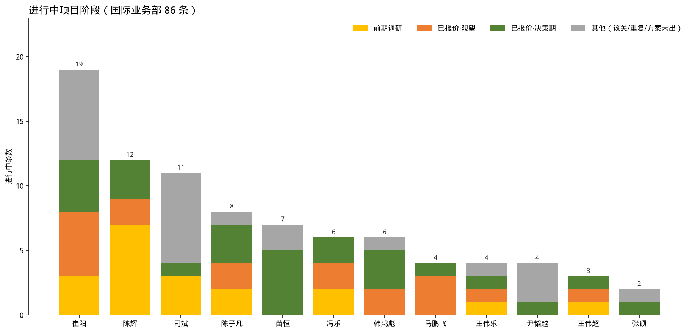

# 方案任务跟进质量（截至 8 月 17 日，国际业务部）

数据：国际业务部累计创建 **165** 条（已剔国内业务部郭朝伟 4 条）；崔阳 38 条已补进展。陈子凡：生力/SMC/Manila01 并为一户，MAK 并入蒙古 MAK。完整分析见 `docs/reports/briefings/business/2026-08-17-方案任务跟进质量分析.md`。打单专项（先看丢单条数和原因）见同目录 `2026-08-17-国际业务部打单能力.md`。

## 页 1｜结论

- 165 条方案任务，可确认签约 **1** 条（陈子凡 / 蒙古 MAK 2×150 吨）。
- 有效项目 = 签约 1 + 有效在手 28 = **29 条，仅 18%**。
- 进行中 86 条；拿掉前期 17、该结未结 16、重复开单后，真在推进的大约 28 条。
- 崔阳：38 条 / 22 个客户，关 19 条全是丢单，有效在手 5 条（与苗恒相同，提报量多一倍）。重点 75 万吨仍无下一步。
- 陈子凡并户后：16 条 / **12 个客户**。生力集团 4 条 + 蒙古 MAK 2 条，是基本盘深挖，不是一人一客。

演讲备注：无配额的问题仍是入口不严 + 该关不关。崔阳是「量大、关账勤、有效少、同一客户拆单」。陈子凡条/客 1.33 和韩鸿彪 1.38 同类——压在能成交的集团户上。

## 页 2｜四维度总表

| 业务员 | 提报 | 客户 | 已结项或暂停 | 前期调研客户 | 重点 | 有效在手 | 有效项目率 | 结项率 |
|--------|-----:|-----:|------------:|------------:|-----:|--------:|----------:|------:|
| 崔阳 | 38 | 22 | 19 | 1 | 1 | 5 | 13% | 50% |
| 苗恒 | 18 | 18 | 11 | 0 | 2 | 5 | 28% | 61% |
| 司斌 | 17 | 15 | 6 | 3 | 1 | 1 | 6% | 35% |
| 陈辉 | 17 | 13 | 5 | 6 | 3 | 3 | 18% | 29% |
| 陈子凡 | 16 | 12 | 8 | 2 | 4 | 3 | 25% | 50% |
| 尹韬越 | 13 | 12 | 9 | 0 | 0 | 1 | 8% | 69% |
| 韩鸿彪 | 11 | 8 | 4 | 0 | 0 | 4 | 36% | 36% |
| 马鹏飞 | 11 | 11 | 7 | 0 | 0 | 1 | 9% | 64% |
| 王伟乐 | 8 | 8 | 4 | 1 | 2 | 1 | 13% | 50% |
| 冯乐 | 6 | 5 | 0 | 2 | 1 | 2 | 33%* | 0% |
| 张硕 | 5 | 5 | 2 | 0 | 0 | 1 | 20%* | 40% |
| 王伟超 | 5 | 5 | 2 | 1 | 1 | 1 | 20%* | 40% |

\* 样本小于 8。不含郭朝伟。

演讲备注：结项率高只说明关账快。崔阳 50%、马鹏飞 64%、尹韬越 69% 主要是丢单。韩鸿彪 / 苗恒 / 陈子凡是「提了还能剩下真项目」。

## 页 3｜重点与崔阳补录

- 已签约 / 真在推：陈子凡 4 条重点全部有效（蒙古 MAK 签约 + 气力、生力取料机、MONCEMENT）；陈辉大宇 / Lanwa；苗恒墨西哥；王伟乐裕廊港；王伟超哥斯达黎加等。
- 该降级：陈辉塞拉利昂缺资金；崔阳 75 万吨只有「进行中 重点任务」。
- 崔阳必须先合并：Powerz 7 条、Эннова 5 条、cotes 4 条。3 条方案未出数月（希望不大）应立即暂停。

## 页 4｜客户集中度：项目数大于 2 的客户

够格的只有 **7 户、31 条**（占 165 条的 19%）。生力/SMC/Manila01 已并一户。

| 排名 | 客户 | 业务员 | 项目数 | 已丢 | 怎么读 |
|-----:|------|--------|------:|-----:|--------|
| 1 | Powerz | 崔阳 | **7** | 5 | 反复探价，5 条丢给当地/其他家 |
| 2 | Эннова | 崔阳 | **5** | 1 | 3 条方案未出数月还挂着 |
| 3 | 菲律宾生力集团 | 陈子凡 | **4** | 2 | 取料机还在跟，临建/平方仓已丢 |
| 3 | 韩国 Kim | 陈辉 | **4** | 3 | 一个渠道四条询价，关掉 3 条 |
| 3 | cotes | 崔阳 | **4** | 1 | 两处技术探讨还在 |
| 3 | 越南 QNC | 韩鸿彪 | **4** | 0 | 有节点；料场/船对船已暂停 |
| 7 | 咖啡仓 | 司斌 | **3** | 0 | 三条全进行中，该关没关 |

演讲备注：先报这 7 户。崔阳 Powerz + Эннова + cotes = 16 条。生力、QNC 是该跟的深；Powerz、Эннова、咖啡仓是拆单。蒙古 MAK 刚好 2 条（已签约+气力），不进「大于 2」这张榜。

## 页 5｜一个客户一个项目：都在铺新客户

条/客 = 1.00、客户从未拆过 2 条的，只有 5 人。没有基本盘，**每一条都是新客户**。开发新客户要比维护老客户难得多，要重视客户黏性。

| 业务员 | 任务 = 客户 | 丢单 | 有效在手 | 有效项目率 |
|--------|------------:|-----:|--------:|----------:|
| 苗恒 | **18** | 8 | **5** | 28% |
| 马鹏飞 | **11** | 7 | 1 | 9% |
| 王伟乐 | **8** | 4 | 1 | 13% |
| 张硕 | 5 | 2 | 1 | 20%* |
| 王伟超 | 5 | 1 | 1 | 20%* |

5 人合计 47 个新客户，占国际部客户的 35%。

演讲备注：开发新客户比维护老客户难得多，要重视黏性。同一打法结果差一截——苗恒留下 5 条，马鹏飞 11 条死 7 条。一人一客不是成绩；韩鸿彪 QNC、陈子凡生力/MAK 才是黏住了的。尹韬越 13/12，只多拆了征地 V1/V2，接近但不算。

## 页 6｜进行中：前期 / 观望 / 决策

进行中 **86 条**。前期 = 规划预算未报价；观望 = 报完主要是等；决策期 = 报完且业主在比选/授标/见面/征地；其他 = 该关、重复、方案未出。

| 业务员 | 进行中 | 前期 | 观望 | 决策期 | 其他 |
|--------|------:|-----:|-----:|------:|-----:|
| 崔阳 | 19 | 3 | 5 | 4 | 7 |
| 陈辉 | 12 | 7 | 2 | 3 | 0 |
| 司斌 | 11 | 3 | 0 | 1 | 7 |
| 陈子凡 | 8 | 2 | 2 | 3 | 1 |
| 苗恒 | 7 | 0 | 0 | **5** | 2 |
| 冯乐 | 6 | 2 | 2 | 2 | 0 |
| 韩鸿彪 | 6 | 0 | 2 | 3 | 1 |
| 马鹏飞 | 4 | 0 | 3 | 1 | 0 |
| 王伟乐 | 4 | 1 | 1 | 1 | 1 |
| 尹韬越 | 4 | 0 | 0 | 1 | 3 |
| 王伟超 | 3 | 1 | 1 | 1 | 0 |
| 张硕 | 2 | 0 | 0 | 1 | 1 |
| **合计** | **86** | **19** | **18** | **26** | **23** |

演讲备注：真往前走的是决策期 26 条。苗恒 7 条里 5 条在决策期。陈辉 12 条里 7 条还是前期。崔阳、司斌的「其他」都是 7 条——该关没关，不是在打单。

## 页 7｜机制建议

1. 预算 / 探价 / 澄清未回 → 标「前期」；同一客户默认一条任务。生力 / 蒙古 MAK / QNC 按装置拆可以，月报按客户看。
2. 已报价超过 60 天无互动，或方案未出数月写希望不大 → 暂停或丢单。
3. 在手重点必须有业主节点。
4. 标题必须带 C 编码。陈子凡生力 4 条都没写，靠这次业务确认才并得上。
5. 月度会改报：有效在手、前期调研客户、该结未结、重点下一步。提报条数和客户数一起看。
6. 开发新客户比维护老客户难得多，月报要看客户黏性：老客户有没有第二单、有没有节点，不要只报新开了几户。
