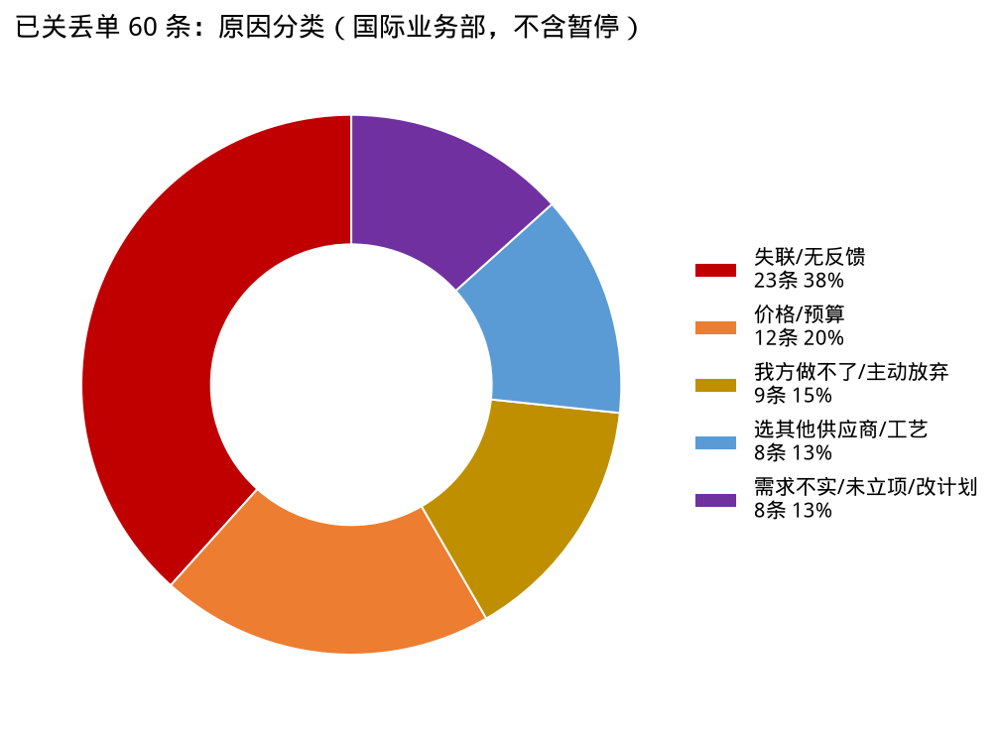
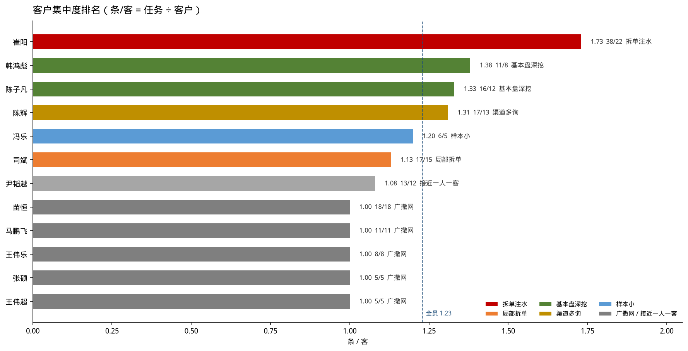

# 方案任务跟进质量（截至 8 月 17 日，国际业务部）

数据：国际业务部累计创建 **165** 条（已剔国内业务部郭朝伟 4 条）；崔阳 38 条已补进展。陈子凡：生力/SMC/Manila01 并为一户，MAK 并入蒙古 MAK。完整分析见 `docs/reports/briefings/business/2026-08-17-方案任务跟进质量分析.md`。打单专项（先看丢单条数和原因）见同目录 `2026-08-17-国际业务部打单能力.md`。

## 页 1｜开场

截止到8月17日，国际业务部累计创建方案设计任务 **165** 个，其中，已结项（签约）**1** 个（蒙古 MAK 2×150 吨小仓）、已丢单（含暂停）**77** 个，进行中 **87** 个。状态已全部标注。

各业务员（按组别）：

| 组别 | 业务员 | 总提报任务量 | 已结项（签约） | 丢单（含暂停） | 进行中 | 打单评价 |
|------|--------|------------:|--------------:|--------------:|------:|----------|
| 一组 | 陈子凡 | 16 | **1** | 7 | 8 | 唯一签约，生力/MAK跟得住；丢7条，进行中仍有该关的 |
| 一组 | 张硕 | 5 | 0 | 2 | 3 | 斯里兰卡跟到决策期；量少一人一客，还有一条该结 |
| 二组 | 司斌 | 17 | 0 | 6 | 11 | 斯里兰卡稻谷在决策期；挂账11条，大半该关没关 |
| 二组 | 王伟超 | 5 | 0 | 2 | 3 | 哥斯达黎加跟到决策期；量少、一人一客 |
| 三组 | 王伟乐 | 8 | 0 | 4 | 4 | 裕廊港还在推进；一半已丢，其余进行中偏浅 |
| 三组 | 马鹏飞 | 11 | 0 | 7 | 4 | 敢关账，冷却站还在跟；11条死7条，进行中多在观望 |
| 五组 | 陈辉 | 17 | 0 | 5 | 12 | 大宇、Lanwa还在跟；进行中12条大半仍是前期 |
| 五组 | 冯乐 | 6 | 0 | 0 | 6 | 坦桑、也门有澄清；6条一笔没关，不是没丢 |
| 六组 | 韩鸿彪 | 11 | 0 | 5 | 6 | 丢掉最少，QNC跟得住；进行中还有该关的 |
| 六组 | 苗恒 | 18 | 0 | 11 | 7 | 进行中质量最好（5条决策期）；客户最散，失联丢单多 |
| 俄语组 | 崔阳 | 38 | 0 | 19 | **19** | 关得勤，留下5条；提报、丢单、拆单都最多，挂账19条 |
| 俄语组 | 尹韬越 | 13 | 0 | 9 | 4 | 关账最勤；进行中多半只有「已报价」 |
| **合计** | | **165** | **1** | **77** | **87** | |

组别：一组陈子凡/张硕，二组司斌/王伟超，三组王伟乐/马鹏飞，五组陈辉/冯乐，六组韩鸿彪/苗恒，俄语组崔阳/尹韬越。丢单（含暂停）= 丢单 60 + 暂停 17。进行中是状态栏的 87 条。

演讲备注：评价先优点后问题。陈子凡签了、韩鸿彪丢掉少、苗恒进行中质量好。崔阳关得勤但量最大丢最多。冯乐0丢单不要表扬——账没关。

## 页 2｜丢单原因五类

已关掉、判定丢掉的 **60 条**（不含暂停 17 条）。一条只归一类。

| 原因分类 | 条数 | 占比 | 主要是谁 |
|----------|-----:|-----:|----------|
| 失联 / 报后无反馈 | **23** | **38%** | 苗恒 5、马鹏飞 4、王伟乐 4、司斌 3 |
| 价格 / 预算 | 12 | 20% | 崔阳 5、尹韬越 3 |
| 我方做不了 / 主动放弃 | 9 | 15% | 陈子凡 3、马鹏飞 3 |
| 选其他供应商 / 工艺 | 8 | 13% | 几乎全是崔阳（Powerz） |
| 需求不实 / 未立项 / 改计划 | 8 | 13% | 崔阳 3、苗恒 2、陈辉 2 |
| **合计** | **60** | **100%** | |

演讲备注：第一因是失联，不是价格。选其他家基本是崔阳一个人。尹韬越另有 4 条暂停也是失联，若算上，失联更头重。

## 页 3｜四维度总表

| 业务员 | 提报 | 客户 | 已结项或暂停 | 前期调研客户 | 重点 | 有效在手 | 有效项目率 | 结项率 |
|--------|-----:|-----:|------------:|------------:|-----:|--------:|----------:|------:|
| 崔阳 | 38 | 22 | 19 | 1 | 1 | 5 | 13% | 50% |
| 苗恒 | 18 | 18 | 11 | 0 | 2 | 5 | 28% | 61% |
| 司斌 | 17 | 15 | 6 | 3 | 1 | 1 | 6% | 35% |
| 陈辉 | 17 | 13 | 5 | 6 | 3 | 3 | 18% | 29% |
| 陈子凡 | 16 | 12 | 8 | 2 | 4 | 3 | 25% | 50% |
| 尹韬越 | 13 | 12 | 9 | 0 | 0 | 1 | 8% | 69% |
| 韩鸿彪 | 11 | 8 | 5 | 0 | 0 | 4 | 36% | 45% |
| 马鹏飞 | 11 | 11 | 7 | 0 | 0 | 1 | 9% | 64% |
| 王伟乐 | 8 | 8 | 4 | 1 | 2 | 1 | 13% | 50% |
| 冯乐 | 6 | 5 | 0 | 2 | 1 | 2 | 33%* | 0% |
| 张硕 | 5 | 5 | 2 | 1 | 0 | 1 | 20%* | 40% |
| 王伟超 | 5 | 5 | 2 | 1 | 1 | 1 | 20%* | 40% |

\* 样本小于 8。不含郭朝伟。

演讲备注：结项率高只说明关账快。崔阳 50%、马鹏飞 64%、尹韬越 69% 主要是丢单。韩鸿彪 / 苗恒 / 陈子凡是「提了还能剩下真项目」。

## 页 4｜重点项目（按业务员）

15 条。按开场表组别、业务员排。表中为 0：张硕、马鹏飞、韩鸿彪、尹韬越。

| 组别 | 业务员 | 重点 | 已签约 | 进行中有效 | 该降级 / 已暂停 |
|------|--------|-----:|------:|----------:|----------------:|
| 一组 | 陈子凡 | **4** | **1** | 3 | 0 |
| 一组 | 张硕 | 0 | 0 | 0 | 0 |
| 二组 | 司斌 | 1 | 0 | 1 | 0 |
| 二组 | 王伟超 | 1 | 0 | 1 | 0 |
| 三组 | 王伟乐 | 2 | 0 | 1 | 1 浅层 |
| 三组 | 马鹏飞 | 0 | 0 | 0 | 0 |
| 五组 | 陈辉 | 3 | 0 | 2 | 1 前期 |
| 五组 | 冯乐 | 1 | 0 | 1 | 0 |
| 六组 | 韩鸿彪 | 0 | 0 | 0 | 0 |
| 六组 | 苗恒 | 2 | 0 | 1 | 1 已暂停 |
| 俄语组 | 崔阳 | 1 | 0 | 0 | **1 浅层** |
| 俄语组 | 尹韬越 | 0 | 0 | 0 | 0 |
| **合计** | | **15** | **1** | **10** | **4** |

| 组别 | 业务员 | 项目 | 状态 | 判断 |
|------|--------|------|------|------|
| 一组 | 陈子凡 | 蒙古 MAK 2×150 吨小仓 | 签约 | **已签约** |
| 一组 | 陈子凡 | 蒙古 MAK 气力输送更新 | 进行中 | 有效 |
| 一组 | 陈子凡 | 菲律宾生力取料机 | 进行中 | 有效 |
| 一组 | 陈子凡 | MONCEMENT 3×2000 | 进行中 | 有效 |
| 二组 | 司斌 | 斯里兰卡 30×3500 稻谷 | 进行中 | 决策期，钢构价拿不到 |
| 二组 | 王伟超 | 哥斯达黎加咖啡仓 | 进行中 | 有效，到过工厂 |
| 三组 | 王伟乐 | 裕廊港 12×10000 | 进行中 | 有效，澄清中 |
| 三组 | 王伟乐 | CIMAF 1×700 | 进行中 | 浅层，库龄偏长 |
| 五组 | 陈辉 | 韩国大宇磷矿粉 | 进行中 | 有效 |
| 五组 | 陈辉 | Lanwa 水泥混拌 | 进行中 | 有效 |
| 五组 | 陈辉 | 塞拉利昂 clinker | 进行中 | **前期，缺资金** |
| 五组 | 冯乐 | 坦桑 2×4500 小麦仓 | 进行中 | 有效 |
| 六组 | 苗恒 | 墨西哥粮仓 | 进行中 | 有效 |
| 六组 | 苗恒 | 孟加拉稻谷 | 暂停 | 已关，对的 |
| 俄语组 | 崔阳 | 75 万吨小麦深加工 | 进行中 | **浅层，无下一步** |

演讲备注：陈子凡 4 条全有效。韩鸿彪没标重点，但有效项目率最高。该降级：塞拉利昂、CIMAF、崔阳 75 万吨。苗恒孟加拉暂停是对的。

## 页 5｜客户集中度排名

条/客 = 任务 ÷ 客户。全员 **1.23**。高不一定好：拆单和基本盘都会抬高。

| 排名 | 组别 | 业务员 | 任务 | 客户 | 条/客 | 类型 | 怎么读 |
|-----:|------|--------|-----:|-----:|------:|------|--------|
| 1 | 俄语组 | 崔阳 | 38 | 22 | **1.73** | 拆单注水 | 前三户 16 条，集中在死单 |
| 2 | 六组 | 韩鸿彪 | 11 | 8 | **1.38** | 基本盘深挖 | QNC 占 36%，健康但单一 |
| 3 | 一组 | 陈子凡 | 16 | 12 | **1.33** | 基本盘深挖 | 生力 + MAK，含唯一签约 |
| 4 | 五组 | 陈辉 | 17 | 13 | 1.31 | 渠道多询 | Kim 四条询价，关了 3 条 |
| 5 | 五组 | 冯乐 | 6 | 5 | 1.20* | 样本小 | 同一编码跨区域 |
| 6 | 二组 | 司斌 | 17 | 15 | 1.13 | 局部拆单 | 咖啡仓 3 条全挂着 |
| 7 | 俄语组 | 尹韬越 | 13 | 12 | 1.08 | 接近一人一客 | 只多拆了征地 |
| 8 | 六组 | 苗恒 | 18 | 18 | 1.00 | 广撒网 | 铺得最开，留下 5 条 |
| 9 | 三组 | 马鹏飞 | 11 | 11 | 1.00 | 广撒网 | 11 条死 7 条 |
| 10 | 三组 | 王伟乐 | 8 | 8 | 1.00 | 广撒网 | 一半丢掉 |
| 11 | 一组 | 张硕 | 5 | 5 | 1.00* | 广撒网 | 样本小 |
| 11 | 二组 | 王伟超 | 5 | 5 | 1.00* | 广撒网 | 样本小 |

项目数 > 2 的客户只有 **7 户、31 条**：

| 排名 | 客户 | 业务员 | 项目数 | 已丢 | 怎么读 |
|-----:|------|--------|------:|-----:|--------|
| 1 | Powerz | 崔阳 | **7** | 5 | 反复探价，5 条丢给当地/其他家 |
| 2 | Эннова | 崔阳 | **5** | 1 | 3 条方案未出数月还挂着 |
| 3 | 菲律宾生力集团 | 陈子凡 | **4** | 2 | 取料机还在跟，临建/平方仓已丢 |
| 3 | 韩国 Kim | 陈辉 | **4** | 3 | 一个渠道四条询价，关掉 3 条 |
| 3 | cotes | 崔阳 | **4** | 1 | 两处技术探讨还在 |
| 3 | 越南 QNC | 韩鸿彪 | **4** | 0 | 有节点；料场/船对船已暂停 |
| 7 | 咖啡仓 | 司斌 | **3** | 0 | 三条全进行中，该关没关 |

演讲备注：先报条/客。崔阳最高是拆单死单。韩鸿彪、陈子凡是健康集中。底下五个 1.00 是铺新客户。再报这 7 户：生力、QNC 该跟；Powerz、Эннова、咖啡仓是拆单。蒙古 MAK 刚好 2 条，不进「大于 2」这张榜。

## 页 6｜一个客户一个项目：都在铺新客户

条/客 = 1.00、客户从未拆过 2 条的，只有 5 人。没有基本盘，**每一条都是新客户**。开发新客户要比维护老客户难得多，要重视客户黏性。

| 业务员 | 任务 = 客户 | 丢单 | 有效在手 | 有效项目率 |
|--------|------------:|-----:|--------:|----------:|
| 苗恒 | **18** | 8 | **5** | 28% |
| 马鹏飞 | **11** | 7 | 1 | 9% |
| 王伟乐 | **8** | 4 | 1 | 13% |
| 张硕 | 5 | 2 | 1 | 20%* |
| 王伟超 | 5 | 1 | 1 | 20%* |

5 人合计 47 个新客户，占国际部客户的 35%。

演讲备注：开发新客户比维护老客户难得多，要重视黏性。同一打法结果差一截——苗恒留下 5 条，马鹏飞 11 条死 7 条。一人一客不是成绩；韩鸿彪 QNC、陈子凡生力/MAK 才是黏住了的。尹韬越 13/12，只多拆了征地 V1/V2，接近但不算。

## 页 7｜进行中：前期 / 观望 / 决策

进行中 **87 条**。前期 = 规划预算未报价；观望 = 报完主要是等；决策期 = 报完且业主在比选/授标/见面/征地；其他 = 该关、重复、方案未出。

| 业务员 | 进行中 | 前期 | 观望 | 决策期 | 其他 |
|--------|------:|-----:|-----:|------:|-----:|
| 崔阳 | 19 | 3 | 5 | 4 | 7 |
| 陈辉 | 12 | 7 | 2 | 3 | 0 |
| 司斌 | 11 | 3 | 0 | 1 | 7 |
| 陈子凡 | 8 | 2 | 2 | 3 | 1 |
| 苗恒 | 7 | 0 | 0 | **5** | 2 |
| 冯乐 | 6 | 2 | 2 | 2 | 0 |
| 韩鸿彪 | 6 | 0 | 2 | 3 | 1 |
| 马鹏飞 | 4 | 0 | 3 | 1 | 0 |
| 王伟乐 | 4 | 1 | 1 | 1 | 1 |
| 尹韬越 | 4 | 0 | 0 | 1 | 3 |
| 王伟超 | 3 | 1 | 1 | 1 | 0 |
| 张硕 | 3 | 1 | 0 | 1 | 1 |
| **合计** | **87** | **20** | **18** | **26** | **23** |

演讲备注：真往前走的是决策期 26 条。苗恒 7 条里 5 条在决策期。陈辉 12 条里 7 条还是前期。崔阳、司斌的「其他」都是 7 条——该关没关，不是在打单。

## 页 8｜机制建议

1. 预算 / 探价 / 澄清未回 → 标「前期」；同一客户默认一条任务。生力 / 蒙古 MAK / QNC 按装置拆可以，月报按客户看。
2. 已报价超过 60 天无互动，或方案未出数月写希望不大 → 暂停或丢单。
3. 在手重点必须有业主节点。
4. 标题必须带 C 编码。陈子凡生力 4 条都没写，靠这次业务确认才并得上。
5. 月度会改报：有效在手、前期调研客户、该结未结、重点下一步。提报条数和客户数一起看。
6. 开发新客户比维护老客户难得多，月报要看客户黏性：老客户有没有第二单、有没有节点，不要只报新开了几户。
