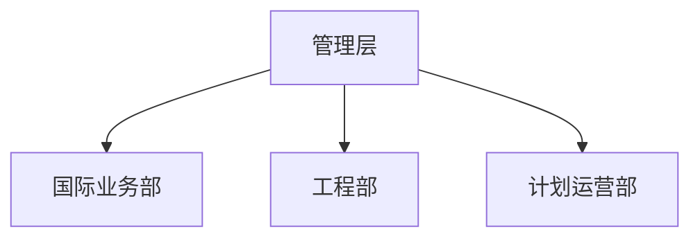

# 组织架构

> 请根据公司实际情况填写。

## 管理层

| 职务 | 姓名 | 分管领域 |
|------|------|----------|
| | | |

## 部门设置

| 部门 | 负责人 | 主要职责 |
|------|--------|----------|
| 国际业务部 | | 海外业务拓展、项目执行 |
| 工程部 | | 国内工程项目施工管理 |
| 计划运营部 | | 公司经营计划、运营管理 |

## 组织图

（可补充 Mermaid 组织图）

