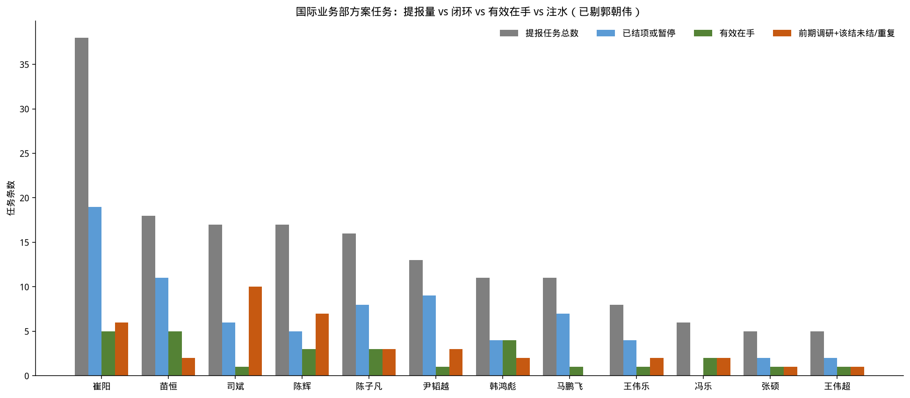
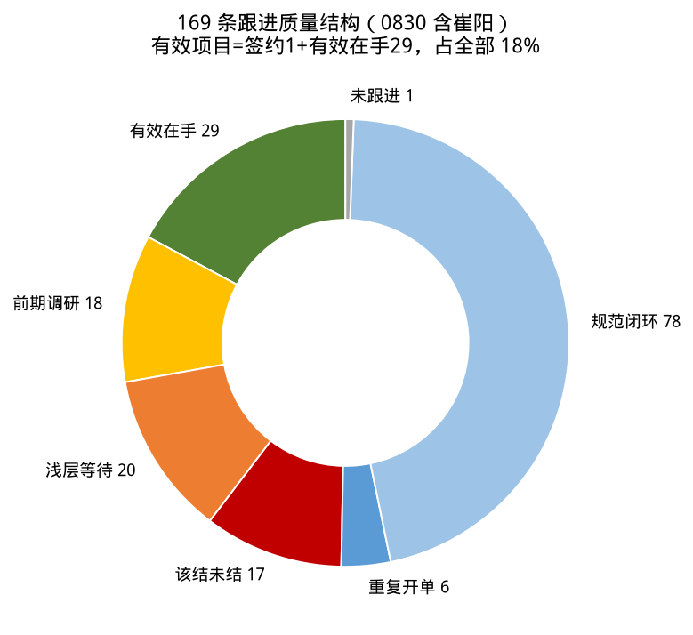
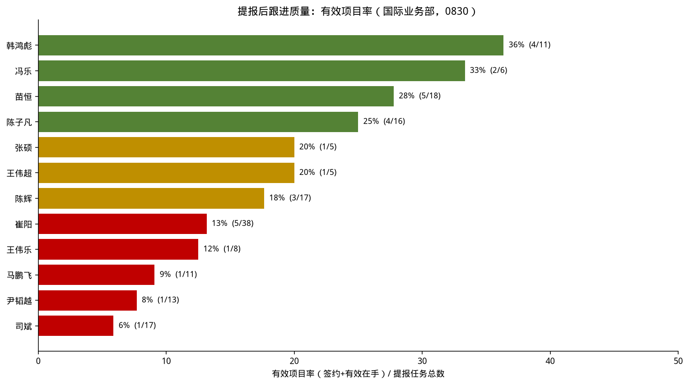
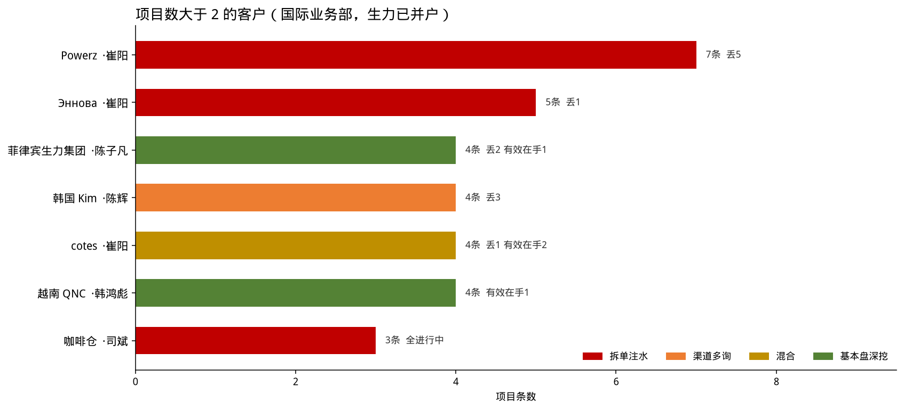
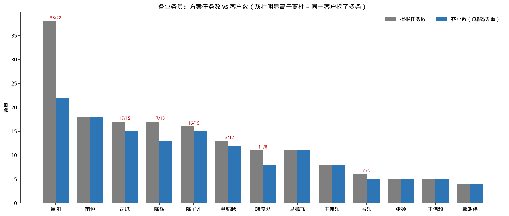
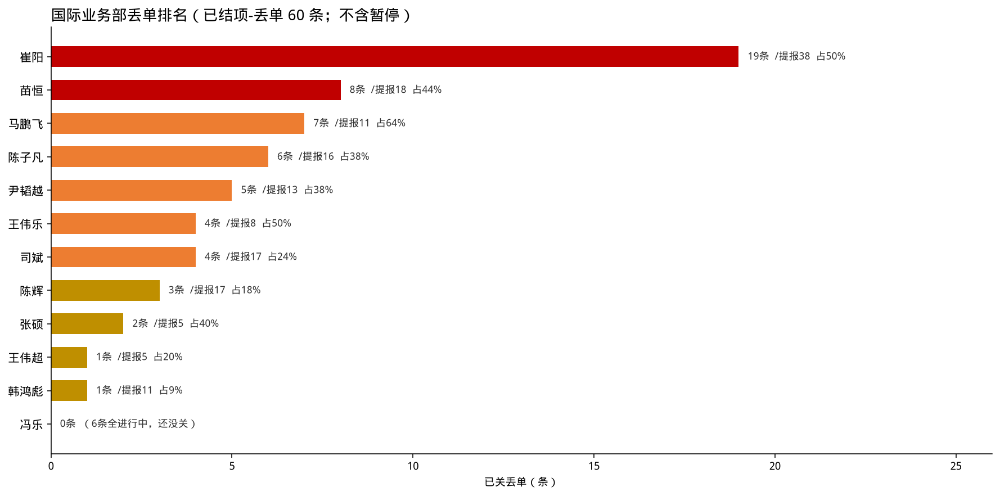
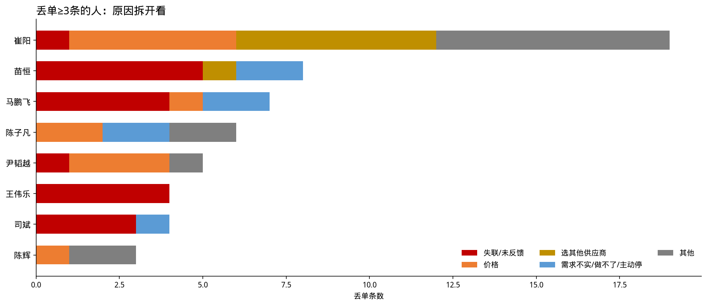

# 方案任务跟进质量分析

**数据**：国际业务部累计创建方案任务，2026-01-01 至 2026-08-17，**165 条**（已剔除国内业务部郭朝伟 4 条）。填报版本 0830，**崔阳 38 条已补进展和状态**；其他人与 0821 版一致。  
**客户并户（业务确认）**：陈子凡未标编码的菲律宾生力集团、SMC、Manila01 视为同一客户；标题含 MAK 的并入蒙古 MAK。  
**要回答的问题**：没有配额之后，提报是否随意、提报后是否跟得住、有效项目够不够。  
**配套表**：同目录 `2026-08-17-方案任务跟进质量分析.xlsx`。

---

## 一、先看结论

国际业务部 165 条里，**能确认签约的只有 1 条**（陈子凡 / 蒙古 MAK 2×150 吨）：

| 口径 | 数量 | 占全部 |
|------|-----:|--------:|
| 有效项目（签约 1 + 有效在手 28） | 29 | **18%** |
| 规范闭环（该关已关） | 77 | 47% |
| 前期调研 | 17 条 / **16 个客户** | 10% |
| 浅层等待 | 20 | 12% |
| 该结未结 + 重复开单 | 16 + 6 | 13% |

进行中挂着 86 条；拿掉前期调研、该关不关、重复拆单之后，**真正还在推进的约 28 条**。崔阳 38 条只贡献了 5 条有效在手，把全员有效项目率压在 **18%**。

三种病不要混着批：

1. **入口太松**：只要预算、中间商探价、澄清未回、同一客户反复开单。代表：陈辉前期 7 条、司斌预算类、马鹏飞澄清未回、**崔阳 Powerz 7 条 / Эннова 5 条 / cotes 4 条**。  
2. **该关不关**：希望不大、方案未出数月仍挂进行中。代表：司斌 5 条；**崔阳 Эннова / 外贝加尔 / 热电站方案未出 3–6 个月**；冯乐 6 条全未关。  
3. **重点空转**：崔阳唯一重点「75 万吨小麦深加工」只写了「进行中 重点任务」，没有下一步。  
4. **客户集中度分化**：标题里的 C 编码是客户。165 条对应约 **134 个客户**。崔阳 38 条只覆盖 22 个客户（1.73 条/客），集中在反复探价、反复丢掉的户上。陈子凡并户后是 16 条 / **12 个客户**（1.33 条/客）：生力集团（含 SMC、Manila01）4 条 + 蒙古 MAK 2 条，这是基本盘深挖。韩鸿彪压在 QNC 上也是健康集中。苗恒、马鹏飞、王伟乐是一人一客。

---

## 二、口径（怎么数）

| 维度 | 怎么算 |
|------|--------|
| 提报任务总数 | 管家创建的方案任务条数；同一客户多条分别计 |
| 已结项或暂停 | 已结项-签约 / 已结项-丢单 / 已结项 / 暂停 / 项目暂停 |
| 前期调研 | 规划、只要预算、了解价格、收集报价、找钱、非最终业主探价、立项观望 |
| 前期调研客户数 | 按客户编码去重；无编码按标题 |
| 客户数（集中度） | 标题中的 `C0xxxxxxx` 去重；无编码各计 1。陈子凡：生力/SMC/Manila01 并为一户，MAK 并入蒙古 MAK。跨业务员不去重 |
| 重点项目 | 标题标注「重点项目」+ 业务确认补录 2 条，国际部共 15 条 |
| 有效在手 | 进行中且有真实互动或下一步，排除纯预算和该结未结 |
| 该结未结 | 失联 / 无反馈 / 希望不大 / 可上可不上，仍挂进行中 |
| 有效项目率 | （签约 + 有效在手）÷ 提报总数 |
| 闭环率（结项率） | 已结项或暂停 ÷ 提报总数。衡量**关账纪律**，不是成交推进快慢 |

冯乐、张硕、王伟超样本量小于 8，百分比只作参考。本表不含国内业务部郭朝伟。

### 结项率能反映什么

结项率高，说明**敢把死项目划掉**。它不能单独证明成交推进快。和有效项目率对着看：

| 结项率 | 有效项目率 | 实际在说什么 | 这张表里的人 |
|--------|------------|--------------|--------------|
| 高 | 相对高 | 关得掉，还剩真项目 | 苗恒 61% / 28%；陈子凡 50% / 25% |
| 高 | 偏低 | 关账快，多半是丢掉 | 尹韬越 69% / 8%；马鹏飞 64% / 9%；**崔阳 50% / 13%**（19 条全是丢单） |
| 低 | 相对高 | 长周期真项目还在跟 | 韩鸿彪 36% / 36% |
| 低 | 低 | 死项目堆在进行中 | 司斌 35% / 6%；陈辉 29% / 18%；冯乐 0% |

崔阳补录后正好落在「高结项、低有效」：关账勤，但关掉的是价格 / 当地供应商 / 未立项，不是签单。这也能说明前期同一客户反复开单、识别不严，后期只好结项。结项率低的人不是识别更好，只是同类问题还堆在进行中。

---

## 三、各业务员四维度对照

| 业务员 | 提报 | 客户数 | 已结项或暂停 | 签约 | 丢单 | 暂停 | 进行中 | 前期调研客户 | 重点 | 有效在手 | 该结未结 | 重复开单 | 有效项目率 | 闭环率 |
|--------|-----:|------:|------------:|-----:|-----:|-----:|------:|------------:|-----:|--------:|--------:|--------:|----------:|------:|
| 崔阳 | 38 | 22 | 19 | 0 | 19 | 0 | 19 | 1 | 1 | **5** | 4 | 1 | 13% | 50% |
| 苗恒 | 18 | 18 | **11** | 0 | 8 | 3 | 7 | 0 | 2 | **5** | 1 | 1 | 28% | 61% |
| 司斌 | 17 | 15 | 6 | 0 | 4 | 2 | **11** | **3** | 1 | 1 | **5** | **2** | **6%** | 35% |
| 陈辉 | 17 | 13 | 5 | 0 | 3 | 2 | 12 | **6** | 3 | 3 | 0 | 0 | 18% | 29% |
| 陈子凡 | 16 | **12** | 8 | **1** | 6 | 1 | 8 | 2 | **4** | 3 | 1 | 0 | 25% | 50% |
| 尹韬越 | 13 | 12 | **9** | 0 | 5 | 4 | 4 | 0 | 0 | 1 | 2 | 1 | 8% | **69%** |
| 韩鸿彪 | 11 | 8 | 4 | 0 | 1 | 3 | 6 | 0 | 0 | **4** | 1 | 1 | **36%** | 36% |
| 马鹏飞 | 11 | 11 | 7 | 0 | 7 | 0 | 4 | 0 | 0 | 1 | 0 | 0 | 9% | 64% |
| 王伟乐 | 8 | 8 | 4 | 0 | 4 | 0 | 4 | 1 | 2 | 1 | 1 | 0 | 13% | 50% |
| 冯乐 | 6 | 5 | **0** | 0 | 0 | 0 | 6 | 2 | 1 | 2 | 0 | 0 | 33%* | **0%** |
| 张硕 | 5 | 5 | 2 | 0 | 2 | 0 | 2 | 0 | 0 | 1 | 1 | 0 | 20%* | 40% |
| 王伟超 | 5 | 5 | 2 | 0 | 1 | 1 | 3 | 1 | 1 | 1 | 0 | 0 | 20%* | 40% |
| **合计** | **165** | **134** | **77** | **1** | **60** | **16** | **86** | **16** | **15** | **28** | **16** | **6** | **18%** | **47%** |

\* 样本小于 8。

崔阳和苗恒有效在手都是 5 条，但崔阳用了 38 条提报，苗恒用了 18 条。

---

## 四、重点项目 15 条

| 业务员 | 项目 | 状态 | 跟进判断 | 一句话 |
|--------|------|------|----------|--------|
| 陈子凡 | 蒙古 MAK 2×150 吨小仓 | 结项-签约 | **已签约** | 样本内唯一签约 |
| 陈子凡 | 菲律宾生力取料机 | 进行中 | 有效 | 等授标（生力集团） |
| 陈子凡 | 蒙古 MAK 气力输送更新 | 进行中（近期可成交） | 有效 | 最接近成单的在手重点 |
| 陈子凡 | MONCEMENT 3×2000 水泥中转 | 进行中 | 有效 | 拜访后更新方案 |
| 陈辉 | 韩国大宇 3 万吨磷矿粉 | 进行中 | 有效 | 多次报价，比仓型 |
| 陈辉 | Lanwa 水泥混拌 | 进行中 | 有效 | 老客户，利润被压 |
| 陈辉 | 塞拉利昂 2×3 万吨 clinker | 进行中 | **前期** | 已拜访，缺资金 |
| 苗恒 | 墨西哥大型粮仓 | 进行中 | 有效 | V4 后更报价 V2 |
| 苗恒 | 孟加拉 2×3000 稻谷 | 暂停 | 已闭环 | 重点已暂停，处理正确 |
| 司斌 | 斯里兰卡 30×3500 稻谷 | 进行中 | 有效但价格死 | 决策期，钢构单价拿不到 |
| 王伟乐 | 新加坡裕廊港 12×10000 | 进行中 | 有效 | 最新价澄清中 |
| 王伟乐 | 摩洛哥 CIMAF 1×700 | 进行中 | 浅层等待 | 已报价、库龄偏长 |
| 王伟超 | 哥斯达黎加咖啡仓 | 进行中 | 有效 | 到过工厂，多次改图 |
| 冯乐 | 坦桑 2×4500 小麦仓 | 进行中 | 有效 | 曾接受报价，新要求已反馈 |
| 崔阳 | 75 万吨小麦深加工 | 进行中 | **浅层** | 只写「进行中 重点任务」，无下一步 |

15 条里：已签约 1、有效跟进 10、前期 1、浅层 2（含崔阳重点）、已暂停 1。陈子凡 4 条全部有效。崔阳重点补了状态，但仍没有可核验的节点。

---

## 五、前期调研：16 个客户

17 条任务、16 个客户。不是跟丢了，是不该按在手项目汇报。

| 业务员 | 客户/项目 | 典型表述 |
|--------|-----------|----------|
| 陈辉（6 个客户，7 条） | 埃及 TCI；塞拉利昂 clinker；突尼斯粮仓；火车卸料/巴西仓；澳洲装配仓；莱歇镀锌仓 | 规划、缺资金、找贷款、只了解仓型和价格 |
| 司斌（3） | 路易达孚咖啡仓；阿联酋饲料（项目在俄）；马来熟料料场 | 只要预算、不一定上 |
| 陈子凡（2） | 蒙古 TESO；北京生物质 | 了解投资预算；较前期 |
| 冯乐（2） | 尼日利亚玉米仓；阿根廷储存仓 | 中间商代询；业主规划 |
| 王伟乐（1） | 苏丹农业银行 | 还在做预算报价 |
| 王伟超（1） | 乌干达生咖啡豆仓 | 非最终业主，了解预算 |
| 崔阳（1） | RUSAGRO 大豆深加工 | 立项阶段，我方范围小，自称暂停仍挂进行中 |

---

## 六、该关不关与重复开单

**该结未结 16 条**（仍标进行中）：

- 司斌 5：咖啡仓三次报价无反馈；越南灰仓；咖啡仓改造可上可不上；多米尼加塑料仓；伊朗石灰仓战争前不可能上。  
- **崔阳 4**：Эннова 电厂脱硫方案未出 3 个月；Powerz 底渣机找不到设备已写暂停；哈萨克热电站方案未出 5 个月；外贝加尔电厂方案未出 6 个月。后三条进展都写「希望不大」。  
- 尹韬越 2：只写「已报价 / 已报方案」。  
- 其余：陈子凡阿根廷希望不大；苗恒斯里兰卡稻谷探价；韩鸿彪广宁雨棚；王伟乐埃及未反馈；张硕印尼料斗无视邮件。

**重复开单 6 条**：

| 客户 | 业务员 | 条数 | 说明 |
|------|--------|------|------|
| C00006570 Powerz | 崔阳 | 7 | 多条设备采购，多数已丢给当地/其他供应商，1 条仍进行中、1 条该暂停未停 |
| C00007843 Эннова | 崔阳 | 5 | 1 条业主评审，3 条方案未出希望不大，1 条已丢 |
| C00006514 cotes | 崔阳 | 4 | 2 条技术探讨、1 条已报价、1 条客户结束询价 |
| C00008345 咖啡仓 | 司斌 | 3 | 三条仍全部进行中 |
| C00009055 CC7 | 崔阳 | 2 | 序号 44 写明与 38 同一项目 |
| 其他 | 苗恒 / 尹韬越 / 韩鸿彪 | 各 2 | 同项目拆条或雨棚重复 |

崔阳 38 条只对应约 **22 个客户**，不是 38 个项目。

---

## 七、逐人（按提报量）

**崔阳（38，有效项目率 13%，结项率 50%）**  
量最大，0830 已补全。关了 19 条，全是丢单：价格 5、选其他/当地供应商 6、未立项/我方拒绝/产能取消等 7、失联 1。有效在手 5 条——Sibur 已勘察出方案、CC7 资质审查、cotes 两处技术探讨、RUSAGRO 种子加工约 9 月考察。进行中另外 8 条是已报价等回复，4 条该关未关（方案未出数月还写希望不大）。唯一重点没有实质进展。和苗恒比：有效在手一样是 5，提报量多一倍。

**苗恒（18，有效项目率 28%，闭环率 61%）**  
关账最干净的大户（不含崔阳的量）。有效在手 5 条（墨西哥粮仓、阿尔及利亚气力、新加坡熟石灰、斯里兰卡熟料业主侧、伊拉克 9.2 见面）。丢单里失联是主流，2 条需求不实已关掉。

**司斌（17，有效项目率 6%）**  
有效项目率最低。进行中 11 条，有效在手只有斯里兰卡 30×3500。其余只要预算、咖啡客户拆单、报价后无反馈仍挂着。

**陈辉（17，前期调研客户 6 个）**  
进行中 12 条里前期 7、浅层 2、有效 3（大宇、Lanwa、大宇卸料 DY）。塞拉利昂重点缺资金未降级。

**陈子凡（16 条 / 12 个客户，唯一签约，重点 4 条，有效项目率 25%）**  
主责综合最好。并户后基本盘清楚：生力集团（含 SMC、Manila01）4 条，蒙古 MAK 2 条（已签约小仓 + 气力更新）。在手重点有节点。扣分在 TESO 只要预算、阿根廷希望不大。仍有 3 条没写编码（北京生物质、南美水泥、巴基斯坦）。

**尹韬越（13，闭环率 69%）**  
关账最勤。俄语区价格丢单多。进行中 2 条只有「已报价」。

**韩鸿彪（11，有效项目率 36%）**  
创建满 8 条的人里跟住率最高。QNC 长周期有节点。

**马鹏飞（11，闭环率 64%，有效项目率 9%）**  
7 条丢单，3 条澄清未回，进管家偏早。在手生力冷却站是真项目。

**王伟乐（8）**  
裕廊港在澄清；CIMAF 偏浅；苏丹仍在预算。

**冯乐（6，闭环率 0%）**  
6 条全进行中。坦桑和也门 V3 有澄清，其余中间商/规划。

**张硕（5）**  
斯里兰卡小麦仓跟得细；印尼料斗该结；哈利法港未跟。

**王伟超（5）**  
哥斯达黎加重点到过工厂。乌干达非业主要预算。

---

## 八、丢单在说什么

有原因记录的关闭里，**客户失联 20 + 未反馈 3** 仍是第一因；价格 12、选其他供应商 8（崔阳补录后这两项明显抬头）、需求不实 2。

崔阳 19 条丢单结构：选其他/当地供应商 6、价格 5、未立项/我方拒绝/产能或工艺取消等 7、失联 1。更像**报完一轮就死、同一客户多次探价**，不是失联型。

- 苗恒、马鹏飞、尹韬越、王伟乐、崔阳：敢关账。  
- 司斌、陈辉、冯乐：同类死单更多还停在进行中。  
- 入口问题：马鹏飞澄清未回、苗恒需求不实、陈子凡中间商存疑、崔阳同一客户反复开单后丢掉。

---

## 九、客户集中度

只看国际业务部。C 编码是客户；陈子凡未标编码的**菲律宾生力集团 / SMC / Manila01 并为一户**，MAK 并入蒙古 MAK。165 条 ≈ **134 个客户**。

### 1. 项目数大于 2 的客户（按条数）

够格的只有 **7 户、31 条**，占全部任务的 19%。其余客户都是 1 条或刚好 2 条。

| 排名 | 客户 | 编码 | 业务员 | 项目数 | 已丢 | 暂停 | 进行中 | 有效在手 | 怎么读 |
|-----:|------|------|--------|------:|-----:|-----:|------:|--------:|--------|
| 1 | Powerz | C00006570 | 崔阳 | **7** | 5 | 0 | 2 | 0 | 5 条已丢给当地/其他供应商；底渣机该停未停 |
| 2 | Эннова | C00007843 | 崔阳 | **5** | 1 | 0 | 4 | 0 | 3 条方案未出数月仍写希望不大 |
| 3 | 菲律宾生力集团 | 无编码，已并户 | 陈子凡 | **4** | 2 | 0 | 2 | 1 | 临建、平方仓已丢；取料机等授标 |
| 3 | 韩国 Kim | C00001305 | 陈辉 | **4** | 3 | 1 | 0 | 0 | 一个渠道四条询价，关掉 3 条 |
| 3 | cotes | C00006514 | 崔阳 | **4** | 1 | 0 | 3 | 2 | 两处技术探讨还在；装配仓已丢 |
| 3 | 越南 QNC | C00008036 | 韩鸿彪 | **4** | 0 | 2 | 2 | 1 | 料场/船对船已暂停；输送还在跟 |
| 7 | 咖啡仓 | C00008345 | 司斌 | **3** | 0 | 0 | 3 | 0 | 方仓、缓冲斗、Probat 三条全挂着 |

崔阳一家占了前三里的两户（Powerz 7 + Эннова 5），再加 cotes 4，**三个客户 16 条**。生力、QNC 是基本盘；Powerz、Эннова、咖啡仓是拆单。

刚好 2 条、不进本榜的 7 户：蒙古 MAK（陈子凡，已签约+气力）、SILOS KZ（崔阳，两条都丢了）、CC7（崔阳，写明同一项目）、RUSAGRO（崔阳）、尹韬越征地 V1/V2、陈辉火车卸料/巴西仓、冯乐 C00009344。

### 2. 按业务员看任务数 vs 客户数

| 业务员 | 任务 | 客户 | 条/客 | 最大客户 | 最大占本人 | 前三大占本人 | ≥2 条的客户 |
|--------|-----:|-----:|------:|----------|----------:|------------:|------------:|
| 崔阳 | 38 | 22 | **1.73** | Powerz C00006570 ×7 | 18% | **42%** | **6**（其中 ≥3 条：3 个） |
| 苗恒 | 18 | 18 | 1.00 | — | 6% | 17% | 0 |
| 陈辉 | 17 | 13 | 1.31 | Kim C00001305 ×4 | 24% | 41% | 2 |
| 司斌 | 17 | 15 | 1.13 | 咖啡仓 C00008345 ×3 | 18% | 29% | 1 |
| 陈子凡 | 16 | **12** | **1.33** | 菲律宾生力集团 ×4 | **25%** | **44%** | **2**（生力 4 + 蒙古 MAK 2） |
| 尹韬越 | 13 | 12 | 1.08 | C00008577 征地 V1/V2 ×2 | 15% | 31% | 1 |
| 韩鸿彪 | 11 | 8 | **1.38** | QNC C00008036 ×4 | **36%** | **55%** | 1 |
| 马鹏飞 | 11 | 11 | 1.00 | — | 9% | 27% | 0 |
| 王伟乐 | 8 | 8 | 1.00 | — | 12% | 38% | 0 |
| 冯乐 | 6 | 5 | 1.20 | C00009344 ×2 | 33% | 67%* | 1 |
| 张硕 | 5 | 5 | 1.00 | — | 20% | 60%* | 0 |
| 王伟超 | 5 | 5 | 1.00 | — | 20% | 60%* | 0 |
| **合计** | **165** | **134** | **1.23** | — | — | — | **14 组重复** |

\* 样本小于 8，「前三大占比」会被小分母抬高，只看条/客和有没有重复客户。

条/客高有两种完全不同的含义，不要一刀切：

| 类型 | 怎么认 | 这张表里 |
|------|--------|----------|
| **拆单注水** | 同一客户多条，多数已死或仍挂着等回复 | 崔阳 Powerz 7 / Эннова 5 / cotes 4；司斌咖啡仓 3 条全进行中；尹韬越同一征地拆 V1/V2 |
| **基本盘深挖** | 同一客户多条，但有节点或已签约 | 陈子凡：生力 4 条 + 蒙古 MAK 2 条（已签约）；韩鸿彪 QNC 4 条（有版本迭代） |
| **广撒网** | 一人一客，条/客 = 1.00 | 苗恒、马鹏飞、王伟乐、张硕、王伟超 |

**陈子凡：并户之后不再是一人一客。** 16 条覆盖 12 个客户（1.33 条/客），和陈辉、韩鸿彪一个量级。两个基本盘：

- **菲律宾生力集团 ×4**（占本人 25%）：机场临建已丢、SMC 平方仓已丢、取料机进行中等授标、Manila01 锥底仓已报价等反馈。同一集团多装置，2 条已关、2 条还在跟。
- **蒙古 MAK ×2**（C00007247）：2×150 吨小仓已签约，气力输送更新近期可成交。该拆。

前三大占他 44%（生力 4 + MAK 2 + 下一家 1）。长尾还有 TESO、MONCEMENT、益海、厄瓜多尔等。仍有 3 条没写编码（北京生物质、南美水泥仓、巴基斯坦稻壳），按各计 1 户。这是**健康集中**：压在能签约、有节点的集团户上，不是崔阳那种同一采购拆 7 单。

**崔阳：量最大，也最集中，但是集中在死单上。** 38 条只覆盖 22 个客户。6 个客户被拆过，前三大就占他 42%（Powerz 7 + Эннова 5 + cotes 4 = 16 条）。这 16 条里有效在手主要是 cotes 两处技术探讨，Powerz 7 条里 5 条已丢给当地/其他供应商，Эннова 5 条里 3 条方案未出数月还写希望不大。另外还有 CC7 ×2（序号 44 写明与 38 同一项目）、RUSAGRO ×2、SILOS KZ ×2（已双双丢单）。

**韩鸿彪：集中，也是健康的那种。** 11 条 / 8 个客户，QNC 一家就占 36%。无编码的广宁雨棚 2 条，名字对得上越南广宁水泥，并回去之后 QNC 可能是 6/11。有效项目率全员最高（36%）。风险是基本盘单一：QNC 一旦停，在手会一起掉。

**陈辉：韩国渠道集中。** Kim C00001305 拆了 4 条（污泥、树脂、石膏），占本人 24%，3 条已关、1 条暂停。另 C00009244 火车卸料 / 巴西仓 2 条都还在前期。这是「一个渠道多询价」，关掉的多，渠道集中 ≠ 项目质量。

**司斌：面上不集中，咖啡仓是例外。** 17 条 / 15 个客户。C00008345 拆成方仓、缓冲斗、Probat 国内方仓 3 条，全挂进行中。有效项目率全员最低（6%），问题主要在该关不关。

**苗恒：最彻底的一人一客。** 18 条 18 个客户。有效在手 5 条、结项率 61%，说明广撒网也可以关得掉、留得下。对照马鹏飞同样 1.00 条/客、有效项目率只有 9%——散开本身不保证质量。

**其余。** 尹韬越除征地 V1/V2 外一人一客。冯乐 C00009344 一条土库曼料斗、一条新疆掺混，同一编码跨区域，样本小不作主判断。

---

## 十、建议

1. **入口**：预算 / 探价 / 澄清未回标「前期」，不进在手项目。同一客户默认一条任务——崔阳 Powerz / Эннова / cotes、司斌咖啡仓必须先合并；陈子凡生力 / 蒙古 MAK、韩鸿彪 QNC 这种有节点的可以按装置拆，但月报按客户看，不要按条数报。  
2. **退出**：已报价超 60 天无互动改暂停；「希望不大 / 方案未出数月」当场结。崔阳 3 条电厂/脱硫未出方案优先清。  
3. **重点要有节点**：崔阳 75 万吨补真实下一步，否则摘标签。陈子凡在手 3 条符合。  
4. **标题必须带 C 编码**：陈子凡生力 4 条都没写码（已靠业务确认并户）；北京生物质、南美、巴基斯坦、苗恒 4 条仍无编码，客户数会偏高。  
5. 月度会改报四列：有效在手、前期调研客户、该结未结、重点下一步。提报总数和客户数一起作分母，避免「条数多、客户少」被当成覆盖面大。

---

## 十一、丢单排名（给 PPT）

专项页：`docs/presentations/management-biweekly/2026/2026-08-17-国际业务部打单能力.md`。  
口径：状态写成「已结项-丢单 / 已结项」的 **60 条**，不含暂停。

| 排名 | 业务员 | 丢单 | 提报 | 占本人 | 原因 |
|-----:|--------|-----:|-----:|------:|------|
| 1 | 崔阳 | **19** | 38 | 50% | 选其他/当地供应商 6；价格 5；未立项/取消/我方不做 7；失联 1 |
| 2 | 苗恒 | 8 | 18 | 44% | 失联 5；需求不实 2；选混凝土仓 1 |
| 3 | 马鹏飞 | 7 | 11 | **64%** | 澄清未回后失联 4；做不了/主动停 2；交期 1 |
| 4 | 陈子凡 | 6 | 16 | 38% | 体量小主动放弃 2；钢构价格、砍预算、临建未参与、中间商存疑各 1 |
| 5 | 尹韬越 | 5 | 13 | 38% | 价格 3；失联 1；报后无回复就结 1。另暂停 4 条也是失联 |
| 6 | 王伟乐 | 4 | 8 | 50% | 未反馈 3；失联 1 |
| 6 | 司斌 | 4 | 17 | 24% | 报价后失联 3；工艺做不了 1 |
| 8 | 陈辉 | 3 | 17 | 18% | Kim 改计划 2；价格不及当地 1 |
| 9 | 张硕 | 2 | 5 | 40% | 失联 2 |
| 10 | 王伟超 | 1 | 5 | 20% | 价格超预算 1 |
| 10 | 韩鸿彪 | 1 | 11 | 9% | 非终端业主后失联 1 |
| 12 | 冯乐 | 0 | 6 | 0% | 6 条全进行中，账没关 |

崔阳一个人丢掉 19 条，占 60 条的三分之一。马鹏飞占本人比例最高。韩鸿彪丢掉最少。冯乐 0 条不是打单好。

